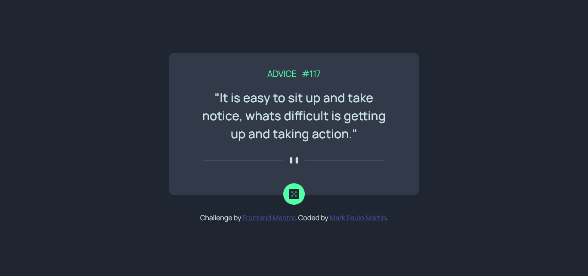

# Frontend Mentor - Advice generator app solution

This is a solution to the [Advice generator app challenge on Frontend Mentor](https://www.frontendmentor.io/challenges/advice-generator-app-QdUG-13db). Frontend Mentor challenges help you improve your coding skills by building realistic projects.

## Table of contents

- [Overview](#overview)
  - [The challenge](#the-challenge)
  - [Screenshot](#screenshot)
  - [Links](#links)
- [My process](#my-process)
  - [Built with](#built-with)
  - [What I learned](#what-i-learned)
  - [Continued development](#continued-development)
  - [Useful resources](#useful-resources)
- [Author](#author)
- [Acknowledgments](#acknowledgments)

## Overview

### The challenge

Users should be able to:

- View the optimal layout for the app depending on their device's screen size
- See hover states for all interactive elements on the page
- Generate a new piece of advice by clicking the dice icon

### Screenshot

### Links

- Solution URL: [Github Repo](https://github.com/mrkmartin/advice-generator-app)
- Live Site URL: [Advice Generator App](https://mrkmartin.github.io/advice-generator-app/)

## My process

### Built with

- Semantic HTML5 markup
- CSS custom properties
- Flexbox
- Mobile-first workflow

### What I learned

I gained knowledge in retrieving data using APIs and adding visual animations to button interactions.

### Continued development

In future projects, I want to continue focusing on
optimizing API interactions for performance. While I learned the basics of fetching data, I'd like to delve deeper into techniques like caching strategies, efficient data handling, and error management to create more robust and faster applications. I also want to become more comfortable with different API authentication methods and understand their security implications better.

### Useful resources

- [MDN](https://developer.mozilla.org/en-US/) - This resource was useful for addressing both styling and animation needs.

## Author

- Frontend Mentor - [@mrkmartin](https://www.frontendmentor.io/profile/mrkmartin)
- Github - [@mrkmartin](https://github.com/mrkmartin)
